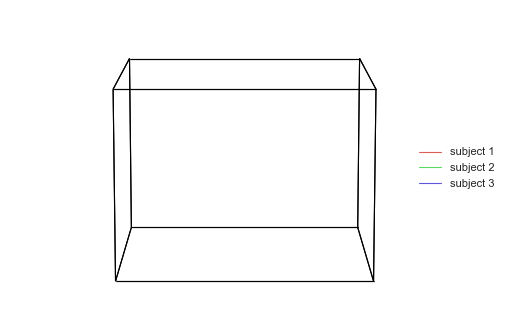

.. hypertools documentation master file, created by
   sphinx-quickstart on Thu Feb  2 08:22:16 2017.
   You can adapt this file completely to your liking, but it should at least
   contain the root `toctree` directive.

**HyperTools**: A python toolbox for gaining geometric insights into high-dimensional data
==============================================================================================

      datasets projected into 3D

`HyperTools <https://github.com/ContextLab/hypertools>`_ is a library for
visualizing and manipulating high-dimensional data in Python. It is built
on top of matplotlib and plotly (for static and interactive plotting),
seaborn (for plot styling), and scikit-learn (for data manipulation). For
sample Jupyter notebooks, click
`here <https://github.com/ContextLab/hypertools-paper-notebooks>`_ and to
read the paper, click `here <https://arxiv.org/abs/1701.08290>`_.

Some key features of HyperTools are:

1. Functions for plotting high-dimensional datasets in 2/3D, statically,
   animated, or fully interactive (``backend='plotly'``)
2. A single canonical pipeline -- manip, normalize, reduce, align,
   cluster -- composable from every entry point
   (see :doc:`pipeline_order`)
3. Dimensionality reduction via PCA, UMAP, t-SNE, and friends, plus
   optional torch-backed autoencoder reducers
4. Data alignment across datasets (hyperalignment, Procrustes, the
   shared response model) and mixture-model ("soft") clustering
5. Timeseries forecasting (``hypertools.predict``) and missing-data
   imputation (``hypertools.impute``)
6. Support for Numpy arrays, Pandas DataFrames (including MultiIndex),
   text, and (mixed) lists, with loaders for local files, URLs, and
   hosted datasets
7. Applying topic models and other text vectorization methods to text
   data

.. toctree::
   :maxdepth: 2
   :caption: Contents:

   api
   pipeline_order
   tutorials
   auto_examples/index

Indices and tables
==================

* :ref:`genindex`
* :ref:`search`
