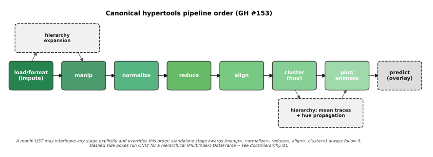

.. _pipeline_order:

The canonical pipeline order
=============================

HyperTools composes several independent operations -- imputing missing
values, per-dataset manipulation, normalization, dimensionality reduction,
hyperalignment, clustering, and finally plotting/animating -- into a single
pipeline. Every dispatcher that accepts more than one of these as kwargs
(`hypertools.plot`, `hypertools.analyze`, `hypertools.reduce`,
`hypertools.align`, `hypertools.cluster`, `hypertools.manip`,
`hypertools.normalize`) runs them in the same order, so that composing
stages via kwargs always means the same thing no matter which function you
called it from (GH #153, GH #138).

    (impute) -> manip -> normalize -> reduce -> align -> cluster (hue) ->
    plot/animate -> predict (overlay), with a side branch showing the two
    hierarchy-only operations for a MultiIndex DataFrame: hierarchy
    expansion feeding into the chain just after load/format, and mean trace
    construction hanging off cluster, just before plot/animate

The canonical order
--------------------

::

    load/format (impute happens here)
      -> [hierarchy expansion, if x is a hierarchical DataFrame]
      -> manip
      -> normalize
      -> reduce
      -> align
      -> cluster (hue)
           \-> [hierarchy: mean trace construction + hue propagation]
      -> plot/animate
      -> predict overlays (one per plotted trajectory, when the
                           shape allows it -- see below)

The two bracketed steps run **only** for a hierarchical (MultiIndex)
DataFrame; every other input goes straight down the linear chain.

Where hierarchy expansion fits
-------------------------------

The hierarchy operations sit deliberately *outside* the linear chain, so
they are drawn as a side branch rather than as ordinary stages. See
:doc:`hierarchy` for what each one does and how the two axes differ.

- **Expansion happens before format/analyze.** A hierarchical frame is
  split into its leaf datasets first, so every leaf then goes through the
  *identical* canonical pipeline -- the same manip, the same normalize, the
  same reduce and align fits. A leaf is not a special kind of dataset; it is
  just a dataset.

- **Mean traces are built after reduce/align**, in the plotted space, from
  the already-transformed leaves. That is why they appear in ``trace_data``
  and never in ``xform_data``: they are presentation artifacts of the
  drawing step, not analysed input datasets. Averaging in the plotted space
  is also what makes a mean sit where the eye expects it -- between its
  members on screen.

- **Hue is co-propagated at that same point.** A continuous ``hue=`` carried
  through a column hierarchy is averaged by the same operation, over the
  same overlapping row range, that averages the data, so an auxiliary value
  can never drift out of step with the trace it describes.

- **Forecasting runs last, over the final traces.** ``predict=`` on a
  hierarchy forecasts every final trace -- each leaf and each derived mean,
  a mean forecast computed from its own averaged trajectory. It therefore
  needs at least 2 rows in every final trace, and raises otherwise.

Why this order
----------------

- **Impute must precede everything.** Every downstream model (manip,
  normalize, reduce, align, cluster) assumes complete data; missing values
  are filled in during `hypertools.load`/format_data, before any other
  stage sees the data.

- **Manip runs in native (per-dataset) space.** `hypertools.manip`
  operations -- smoothing, resampling, z-scoring -- are per-dataset
  preprocessing steps (e.g. denoising a single subject's timeseries) that
  are most meaningful in the data's original feature space, before
  anything has been rescaled or projected. Note that while ``Smooth`` and
  ``Resample`` are applied fully independently to each dataset in a list,
  ``ZScore`` and ``Normalize`` transform each dataset separately but fit
  ONE shared set of statistics (mean/std, or baseline/peak) across every
  dataset in the list -- like ``hypertools.normalize``'s ``'across'``
  mode (see the `hypertools.manip` docstring).

- **Normalize standardizes feature scales** before any distance- or
  variance-based model (reduce, align, cluster) is fit, so that no single
  feature's arbitrary scale dominates the geometry those models discover.

- **Reduce projects to the target dimensionality before align.** This
  preserves hypertools 0.x semantics -- `hypertools.analyze` has always
  been equivalent to ``align(reduce(normalize(x)))`` -- and keeps
  hyperalignment tractable: Procrustes/HyperAlign work with a handful of
  dimensions far more efficiently (and far more robustly against
  overfitting) than with the raw, high-dimensional feature space.

- **Align rotates the reduced datasets into a shared space**, so that
  corresponding dimensions across datasets/subjects/timepoints are
  comparable, which every downstream step (cluster, plot, predict) then
  relies on.

- **Cluster labels the final (reduced, aligned) space**, most commonly to
  drive plot coloring (``hue``), so it runs last among the "geometry"
  stages -- after the space it is labeling has been fully constructed.

- **Plot/animate renders the finished pipeline**, and **predict overlays**
  a forecast/extrapolation *on top of* the rendered result -- it is drawn
  last because it depends on (and visually augments) the already-plotted
  trajectory rather than feeding back into any earlier stage.

- **Antialiasing is applied last of all, at draw time.** Immediately before
  each line is drawn (and *after* every stage above, including the
  ``predict`` overlay), `hypertools.plot`'s ``antialias=True`` default
  upsamples it along a monotone PCHIP interpolant so there are no sharp
  angles between successive observations. It runs last precisely because it
  is a *rendering* step, not an analysis step: it changes only what is
  drawn, never the data any earlier stage produced -- every original sample
  remains an exact vertex of the drawn line, and returned arrays,
  ``return_model=True`` bundles, hulls, densities, per-point labels and
  markers are all unaffected. In an animation each frame draws the smooth
  curve for exactly the portion of the trajectory that frame would have
  shown, leaving frame counts and reveal pacing unchanged. Only styles that
  draw a line are affected (marker-only styles never are); pass
  ``antialias=False`` to draw raw straight segments between samples.

Overriding the order
----------------------

Standalone stage kwargs (``manip=``, ``normalize=``, ``reduce=``,
``align=``, ``cluster=``) always run in the canonical order above, with the
calling function's own stage (if any) slotted in at its position. A
``manip=`` **list** may instead interleave any of the stages explicitly --
an explicit list always overrides the canonical order for the stages it
names. For example::

    import hypertools as hyp

    # canonical order: normalize -> reduce -> align -> cluster
    hyp.plot(data, reduce='UMAP', align='HyperAlign', cluster='KMeans',
             normalize='ZScore')

    # explicit list overrides the order: smooth first, THEN align, THEN
    # reduce with UMAP -- the opposite of "reduce before align"
    hyp.plot(data, manip=['Smooth',
                          {'model': 'HyperAlign', 'kwargs': {'n_iter': 10}},
                          'UMAP'])

Every dispatcher also accepts ``return_model=True`` to get back the fitted
model for reuse: a single fitted wrapper if only one stage ran, or a fitted
`hypertools.Pipeline` if the kwargs triggered multiple stages. A fitted
`hypertools.Pipeline` can be replayed on new data via ``pipeline=`` on
`hypertools.plot`/`hypertools.analyze` (mutually exclusive with the stage
kwargs above -- combining both raises ``ValueError``). See the
:ref:`pipelines & return_model example <examples-index>` for a worked
demonstration.

See also
----------

- :doc:`api` -- full API reference for every stage dispatcher.
- :doc:`tutorials` -- worked tutorials covering each pipeline stage.
- :doc:`/auto_examples/plot_story_trajectories` -- gallery example that
  exercises the full manip -> align -> reduce pipeline.
