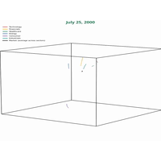
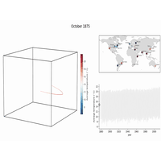
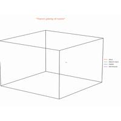
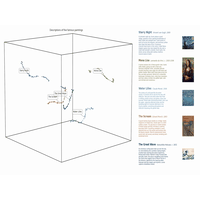
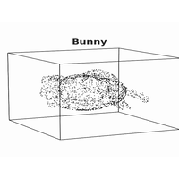

:orphan:

.. _tutorials:

How to use `HyperTools`
=======================

Plot
----------------

.. toctree::
   :maxdepth: 2

   tutorials/plot.ipynb

Analyze
----------------

.. toctree::
  :maxdepth: 2

  tutorials/analyze.ipynb

Normalize
----------------

.. toctree::
  :maxdepth: 2

  tutorials/normalize.ipynb

Reduce
----------------

.. toctree::
  :maxdepth: 2

  tutorials/reduce.ipynb

Align
----------------

.. toctree::
  :maxdepth: 2

  tutorials/align.ipynb

Cluster
----------------

.. toctree::
  :maxdepth: 2

  tutorials/cluster.ipynb

Plotting text
----------------

.. toctree::
  :maxdepth: 2

  tutorials/text.ipynb

Visualizing Hugging Face embeddings
-----------------------------------

.. toctree::
  :maxdepth: 2

  tutorials/hugging_face_embeddings.ipynb

Modern scikit-learn models and dynamics
---------------------------------------

.. toctree::
  :maxdepth: 2

  tutorials/modern_sklearn_dynamics.ipynb

Mapping Wikipedia with modern text embeddings
---------------------------------------------

.. toctree::
  :maxdepth: 2

  tutorials/wikipedia_embeddings.ipynb

Visualizing the shape of a conversation
---------------------------------------

.. toctree::
  :maxdepth: 2

  tutorials/conversation_trajectories.ipynb

Plotting streaming data
-----------------------

.. toctree::
  :maxdepth: 2

  tutorials/streaming_data.ipynb

Streaming from a Lab Streaming Layer (LSL) device
---------------------------------------------------

.. toctree::
  :maxdepth: 2

  tutorials/lsl_streaming.ipynb

Forecasting stock prices with hyp.predict
-----------------------------------------

.. toctree::
  :maxdepth: 2

  tutorials/stock_forecasting.ipynb

Imputing and forecasting a real projectile arc with hyp.impute and hyp.predict
------------------------------------------------------------------------------

.. toctree::
  :maxdepth: 2

  tutorials/projectile_kalman.ipynb

Story trajectories: brain activity while listening to a story
-------------------------------------------------------------

An animated cloud of hyperaligned trajectories showing how all 36 subjects'
whole-brain activity traces out a *shared* path through a low-dimensional space
while they listen to the same spoken story (fMRI data from Simony et al.,
2016). Each subject is preprocessed with a per-subject ``manip`` (Smooth →
Resample → ZScore), **hyperaligned in the 100-hub feature space** (``n_iter=10``)
and only *then* reduced to 3-D with ``reduce='IncrementalPCA'``; an
``animate='window'`` trail then slides along the aligned trajectories so you
watch all 36 subjects move together through the story. Aligning in the hub
space *before* reducing (rather than over-reducing first, which starves
hyperalignment) is what pulls the trajectories together -- their within-timepoint
spread tightens ~30%. See the full gallery example,
:doc:`auto_examples/plot_story_trajectories`.

.. image:: _static/thumbnails/sphx_glr_plot_story_trajectories_thumb.gif
   :width: 400
   :alt: Animated hyperaligned brain-activity trajectories through a spoken story

A quarter century of the market: six sectors, one space
-------------------------------------------------------

Three library calls: ``hyp.reduce`` takes each sector (a months-by-stocks
matrix of growth curves, four or five stocks each) to three dimensions on
its own, ``hyp.align(..., align='hyper')`` hyperaligns the six paths into
one shared space, and ``hyp.plot`` draws them with a seventh, heavier path
-- the market, their mean -- coloured through the mixture hue by each
sector's share of the basket's capitalisation. The title is the current
date, tinted by the basket's trailing-twelve-month return, and the camera
makes three turns over one minute of 26 years. Prices from Yahoo Finance,
share counts from the SEC. (For the column-MultiIndex route to a market
hierarchy, see :doc:`hierarchy`.)

.. toctree::
  :maxdepth: 2

  tutorials/market_sectors.ipynb

A century of weather: twenty cities as twenty features, one hot path
--------------------------------------------------------------------

The figure from the HyperTools paper in one ``hyp.plot`` call: monthly
temperatures for twenty cities are twenty *features* of one trajectory,
not twenty datasets, so 138 years become a single path that sweeps with
the seasons and drifts with the century. A continuous ``hue=`` (the
average temperature across the cities) colours it on a blue-cold /
red-hot scale with a native colorbar; ``manip='Smooth'``,
``normalize='across'`` and ``chemtrails=True`` are the only other
keywords. One ``on_frame`` hook keeps two companion panels and a
month/year title in step with the head of the path over the two-minute
orbit: a world map with each city coloured by that month's temperature,
and the mean temperature against time, drawn segment by segment on the
same colour scale.

.. toctree::
  :maxdepth: 2

  tutorials/weather_decades.ipynb

The shape of a conversation, revealed one turn at a time
--------------------------------------------------------

Raw dialogue in: each turn of the *Mad Tea-Party* is a list of word
windows, and the turns are one list of lists of strings handed to a single
``hyp.plot`` call, so every turn is its own trajectory through one shared
space. ``vectorizer=`` embeds, a categorical ``hue=`` colours by speaker
with a native legend, ``order='serial'`` reveals one turn at a time with
``chemtrails=True``, and a per-turn ``title=`` shows the line being spoken,
wrapped when long, in the speaker's colour. The recency fade across turns
and the title colour run on the public ``on_frame`` hook and read the
schedule the library publishes; thirty seconds, two camera turns.

.. toctree::
  :maxdepth: 2

  tutorials/conversation_shape.ipynb

Five paintings, described in words and drawn in their own colors
----------------------------------------------------------------

Raw text in, five clouds out: a paragraph per painting is cut into word
windows and handed to ``hyp.plot`` as a list of five lists of strings, so
the nesting is the grouping. ``vectorizer='all-MiniLM-L6-v2'`` embeds every
window, ``reduce='UMAP'`` puts them in one shared space, ``labels=`` names
each cloud and ``animate='spin'`` orbits it. Each cloud's colour comes from
its real canvas through ``image_palette``, which orders clusters by
salience rather than size, with one legibility floor on top. Beside the
box, each painting's name with its artist and year, the description that
was embedded, and a thumbnail of the canvas.

.. toctree::
  :maxdepth: 2

  tutorials/painting_embeddings.ipynb

Morphing through the shapes zoo
-------------------------------

``animate='morph'`` flows a cloud of dots from one shape to the next, holding
on each; ``rotations=`` gives every hold and transition its screen time, and
``title=`` takes one string per cloud, shown while that shape is whole and
blanked through the transitions (an ``on_frame`` hook enlarges it and sits
it just above the cloud). The loader degrades to five parametric clouds
when the zoo cannot be fetched, so the notebook always renders.

.. toctree::
  :maxdepth: 2

  tutorials/morph_shapes_zoo.ipynb
