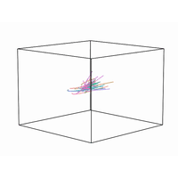

:orphan:

.. _tutorials:

How to use `HyperTools`
=======================

Plot
----------------

.. toctree::
   :maxdepth: 2

   tutorials/plot.ipynb

Analyze
----------------

.. toctree::
  :maxdepth: 2

  tutorials/analyze.ipynb

Normalize
----------------

.. toctree::
  :maxdepth: 2

  tutorials/normalize.ipynb

Reduce
----------------

.. toctree::
  :maxdepth: 2

  tutorials/reduce.ipynb

Align
----------------

.. toctree::
  :maxdepth: 2

  tutorials/align.ipynb

Cluster
----------------

.. toctree::
  :maxdepth: 2

  tutorials/cluster.ipynb

Plotting text
----------------

.. toctree::
  :maxdepth: 2

  tutorials/text.ipynb

Visualizing Hugging Face embeddings
-----------------------------------

.. toctree::
  :maxdepth: 2

  tutorials/hugging_face_embeddings.ipynb

Modern scikit-learn models and dynamics
---------------------------------------

.. toctree::
  :maxdepth: 2

  tutorials/modern_sklearn_dynamics.ipynb

Mapping Wikipedia with modern text embeddings
---------------------------------------------

.. toctree::
  :maxdepth: 2

  tutorials/wikipedia_embeddings.ipynb

Visualizing the shape of a conversation
---------------------------------------

.. toctree::
  :maxdepth: 2

  tutorials/conversation_trajectories.ipynb

Plotting streaming data
-----------------------

.. toctree::
  :maxdepth: 2

  tutorials/streaming_data.ipynb

Streaming from a Lab Streaming Layer (LSL) device
---------------------------------------------------

.. toctree::
  :maxdepth: 2

  tutorials/lsl_streaming.ipynb

Forecasting stock prices with hyp.predict
-----------------------------------------

.. toctree::
  :maxdepth: 2

  tutorials/stock_forecasting.ipynb

Imputing and forecasting a real projectile arc with hyp.impute and hyp.predict
------------------------------------------------------------------------------

.. toctree::
  :maxdepth: 2

  tutorials/projectile_kalman.ipynb

Story trajectories: brain activity while listening to a story
-------------------------------------------------------------

An animated cloud of hyperaligned trajectories showing how all 36 subjects'
whole-brain activity traces out a *shared* path through a low-dimensional space
while they listen to the same spoken story (fMRI data from Simony et al.,
2016). Each subject is preprocessed with a per-subject ``manip`` (Smooth →
Resample → ZScore), **hyperaligned in the 100-hub feature space** (``n_iter=10``)
and only *then* reduced to 3-D with ``reduce='IncrementalPCA'``; an
``animate='window'`` trail then slides along the aligned trajectories so you
watch all 36 subjects move together through the story. Aligning in the hub
space *before* reducing (rather than over-reducing first, which starves
hyperalignment) is what pulls the trajectories together -- their within-timepoint
spread tightens ~30%. See the full gallery example,
:doc:`auto_examples/plot_story_trajectories`.

Six sectors, their stocks, and each sector's mean
-------------------------------------------------

The *column-MultiIndex* hierarchy, six times over: a ``(Sector, Ticker,
Measure)`` frame draws each sector's four stocks as faint leaves and that
sector's mean as a heavier line, all from **one** ``hyp.plot`` call. The six
panels are laid out *in the data* -- each sector's block translated into
its own region of one shared box -- because an animated call owns its
figure, so this is one animation with one pooled scale. Position between
panels is layout, not market data; there is deliberately no market-wide
mean and no forecast. See :doc:`hierarchy` for the column-axis rule.

.. toctree::
  :maxdepth: 2

  tutorials/market_sectors.ipynb

A century of weather: twenty cities as twenty features, one hot path
--------------------------------------------------------------------

The figure from the HyperTools paper in one ``hyp.plot`` call: monthly
temperatures for twenty cities are twenty *features* of one trajectory,
not twenty datasets, so 138 years become a single path that sweeps with
the seasons and drifts with the century. A continuous ``hue=`` (the
average temperature across the cities) colours it on a blue-cold /
red-hot scale with a native colorbar; ``manip='Smooth'``,
``normalize='across'`` and ``chemtrails=True`` are the only other
keywords. No hierarchy, no hand-spliced colormap, no per-frame callback.

.. toctree::
  :maxdepth: 2

  tutorials/weather_decades.ipynb

The shape of a conversation, revealed one turn at a time
--------------------------------------------------------

.. toctree::
  :maxdepth: 2

  tutorials/conversation_shape.ipynb

Five paintings, described in words and drawn in their own colors
----------------------------------------------------------------

Raw text in, five clouds out: a paragraph per painting is cut into word
windows and handed to ``hyp.plot`` as a list of five lists of strings, so
the nesting is the grouping. ``vectorizer='all-MiniLM-L6-v2'`` embeds every
window, ``reduce='UMAP'`` puts them in one shared space, ``labels=`` names
each cloud and ``animate='spin'`` orbits it. Each cloud's colour comes from
its real canvas through ``image_palette``, which orders clusters by
salience rather than size, with one legibility floor on top.

.. toctree::
  :maxdepth: 2

  tutorials/painting_embeddings.ipynb

Morphing through the shapes zoo
-------------------------------

.. toctree::
  :maxdepth: 2

  tutorials/morph_shapes_zoo.ipynb
