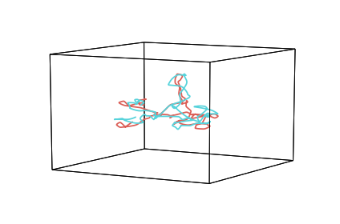
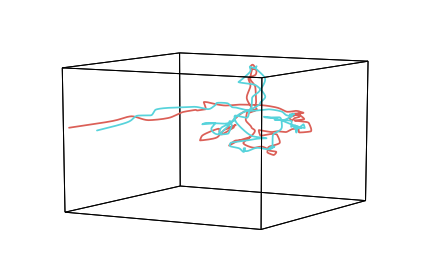

Alignment
=========

The ``align`` function projects 2 or more datasets with different
coordinate systems into a common space. By default it uses the
hyperalignment algorithm (`Haxby et al,
2011 <http://haxbylab.dartmouth.edu/publications/HGC+11.pdf>`__), but
also provides the option to use the Shared Response Model (SRM) for
alignment, if preferred, via the Brain Imaging Analysis Kit
(`brainiak <http://brainiak.org/>`__).

Alignment can be particularly useful in exploring statistical properties
and/or similarities of datasets that are not in the same coordinate
system (such as fMRI data from visual areas of participants watching a
movie, and the movie data itself).

Alignment algorithms use linear transformations to rotate and scale your
datasets so they match as best as possible. For example, take these
three distinct datasets. Each has a similar shape (an S), but are scaled
and rotated differently. Aligning these datasets finds the
transformation that minimizes the distance between them.

Import Hypertools
-----------------

.. code:: ipython3

    import hypertools as hyp
    import numpy as np
    
    %matplotlib inline

Load your data
--------------

First, we'll load one of the sample datasets. This dataset is a list of
2 ``numpy`` arrays, each containing average brain activity (fMRI) from
18 subjects listening to the same story, fit using Hierarchical
Topographic Factor Analysis (HTFA) with 100 nodes. The rows are
timepoints and the columns are fMRI components.

See the `full
dataset <http://dataspace.princeton.edu/jspui/handle/88435/dsp015d86p269k>`__
or the `HTFA
article <https://www.biorxiv.org/content/early/2017/02/07/106690>`__ for
more info on the data and HTFA, respectively.

.. code:: ipython3

    data = hyp.load('weights').get_data()

Visualize unaligned data
------------------------

First, we can see how the first hundred data points from two arrays in
the weights data look when plotted together.

.. code:: ipython3

    # average into two groups
    group1 = np.mean(data[:17], 0)
    group2 = np.mean(data[18:], 0)
    
    # plot
    geo = hyp.plot([group1[:100, :], group2[:100, :]])

Aligning data with Hyperalignment
---------------------------------

Next, we can align the two datasets (using
`hyperalignment <http://papers.nips.cc/paper/5855-a-reduced-dimension-fmri-shared-response-model.pdf>`__)
and visualize the aligned data. Note that the two datasets are now much
more similar to each other.

.. code:: ipython3

    aligned_data = hyp.align(data)
    
    # average into two groups
    group1 = np.mean(aligned_data[:17], 0)
    group2 = np.mean(aligned_data[18:], 0)
    
    # plot
    geo = hyp.plot([group1[:100, :], group2[:100, :]])

Aligning data with the Shared Response Model
--------------------------------------------

You may use the Shared Response Model for alignment by setting ``align``
to 'SRM'.

.. code:: ipython3

    aligned_data = hyp.align(data, align='SRM')
    
    # average into two groups
    group1 = np.mean(aligned_data[:17], 0)
    group2 = np.mean(aligned_data[18:], 0)
    
    # plot
    geo = hyp.plot([group1[:100, :], group2[:100, :]])

