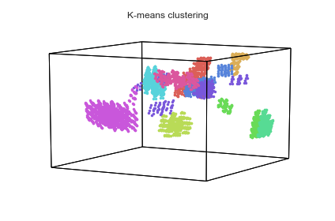
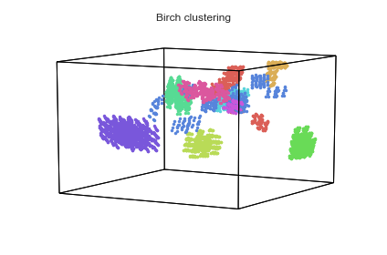

Clustering with Hypertools
==========================

The cluster feature performs clustering analysis on the data (an arrray,
dataframe, or list) and returns a list of cluster labels.

The default clustering method is K-Means (argument 'KMeans') with
MiniBatchKMeans, AgglomerativeClustering, Birch, FeatureAgglomeration,
SpectralClustering and HDBSCAN also supported.

Note that, if a list is passed, the arrays will be stacked and
clustering will be performed *across* all lists (not within each list).

Import Packages
---------------

.. code:: ipython3

    import hypertools as hyp
    from collections import Counter
    
    %matplotlib inline

Load your data
--------------

We will load one of the sample datasets. This dataset consists of 8,124
samples of mushrooms with various text features.

.. code:: ipython3

    mushrooms = hyp.load('mushrooms')

We can peek at the first few rows of the dataframe using the pandas
function ``head()``

.. code:: ipython3

    mushrooms.head()

.. raw:: html

    

    <table border="1" class="dataframe">
      <thead>
        <tr style="text-align: right;">
          <th></th>
          <th>class</th>
          <th>cap-shape</th>
          <th>cap-surface</th>
          <th>cap-color</th>
          <th>bruises</th>
          <th>odor</th>
          <th>gill-attachment</th>
          <th>gill-spacing</th>
          <th>gill-size</th>
          <th>gill-color</th>
          <th>...</th>
          <th>stalk-surface-below-ring</th>
          <th>stalk-color-above-ring</th>
          <th>stalk-color-below-ring</th>
          <th>veil-type</th>
          <th>veil-color</th>
          <th>ring-number</th>
          <th>ring-type</th>
          <th>spore-print-color</th>
          <th>population</th>
          <th>habitat</th>
        </tr>
      </thead>
      <tbody>
        <tr>
          <th>0</th>
          <td>p</td>
          <td>x</td>
          <td>s</td>
          <td>n</td>
          <td>t</td>
          <td>p</td>
          <td>f</td>
          <td>c</td>
          <td>n</td>
          <td>k</td>
          <td>...</td>
          <td>s</td>
          <td>w</td>
          <td>w</td>
          <td>p</td>
          <td>w</td>
          <td>o</td>
          <td>p</td>
          <td>k</td>
          <td>s</td>
          <td>u</td>
        </tr>
        <tr>
          <th>1</th>
          <td>e</td>
          <td>x</td>
          <td>s</td>
          <td>y</td>
          <td>t</td>
          <td>a</td>
          <td>f</td>
          <td>c</td>
          <td>b</td>
          <td>k</td>
          <td>...</td>
          <td>s</td>
          <td>w</td>
          <td>w</td>
          <td>p</td>
          <td>w</td>
          <td>o</td>
          <td>p</td>
          <td>n</td>
          <td>n</td>
          <td>g</td>
        </tr>
        <tr>
          <th>2</th>
          <td>e</td>
          <td>b</td>
          <td>s</td>
          <td>w</td>
          <td>t</td>
          <td>l</td>
          <td>f</td>
          <td>c</td>
          <td>b</td>
          <td>n</td>
          <td>...</td>
          <td>s</td>
          <td>w</td>
          <td>w</td>
          <td>p</td>
          <td>w</td>
          <td>o</td>
          <td>p</td>
          <td>n</td>
          <td>n</td>
          <td>m</td>
        </tr>
        <tr>
          <th>3</th>
          <td>p</td>
          <td>x</td>
          <td>y</td>
          <td>w</td>
          <td>t</td>
          <td>p</td>
          <td>f</td>
          <td>c</td>
          <td>n</td>
          <td>n</td>
          <td>...</td>
          <td>s</td>
          <td>w</td>
          <td>w</td>
          <td>p</td>
          <td>w</td>
          <td>o</td>
          <td>p</td>
          <td>k</td>
          <td>s</td>
          <td>u</td>
        </tr>
        <tr>
          <th>4</th>
          <td>e</td>
          <td>x</td>
          <td>s</td>
          <td>g</td>
          <td>f</td>
          <td>n</td>
          <td>f</td>
          <td>w</td>
          <td>b</td>
          <td>k</td>
          <td>...</td>
          <td>s</td>
          <td>w</td>
          <td>w</td>
          <td>p</td>
          <td>w</td>
          <td>o</td>
          <td>e</td>
          <td>n</td>
          <td>a</td>
          <td>g</td>
        </tr>
      </tbody>
    </table>
    
5 rows × 23 columns

    

Obtain cluster labels
---------------------

To obtain cluster labels, simply pass the data to ``hyp.cluster``. Since
we have not specified a desired number of cluster, the default of 3
clusters is used (labels 0, 1, and 2). Additionally, since we have note
specified a desired clustering algorithm, K-Means is used by default.

.. code:: ipython3

    labels = hyp.cluster(mushrooms)
    set(labels)

.. parsed-literal::

    {0, 1, 2}

We can further examine the number of datapoints assigned each label.

.. code:: ipython3

    Counter(labels)

.. parsed-literal::

    Counter({0: 1768, 1: 5024, 2: 1332})

Specify number of cluster labels
--------------------------------

You can also specify the number of desired clusters by setting the
``n_clusters`` argument to an integer number of clusters, as below. We
can see that when we pass the int 10 to n\_clusters, 10 cluster labels
are assigned.

Since we have note specified a desired clustering algorithm, K-Means is
used by default.

.. code:: ipython3

    labels_10 = hyp.cluster(mushrooms, n_clusters = 10)
    set(labels_10)

.. parsed-literal::

    {0, 1, 2, 3, 4, 5, 6, 7, 8, 9}

Different clustering models
---------------------------

You may prefer to use a clustering model other than K-Means. To do so,
simply pass a string to the cluster argument specifying the desired
clustering algorithm.

In this case, we specify both the clustering model (Birch) and the
number of clusters (10).

.. code:: ipython3

    labels_birch = hyp.cluster(mushrooms, cluster = 'Birch', n_clusters=10)

.. code:: ipython3

    geo  = hyp.plot(mushrooms, '.', group=labels_10, title='K-means clustering')
    geo  = hyp.plot(mushrooms, '.', group=labels_birch, title='Birch clustering')

