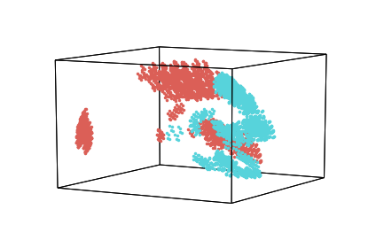
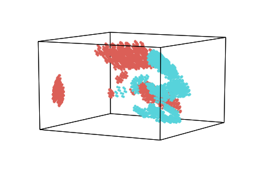
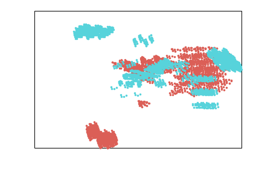
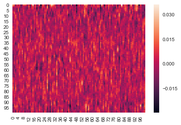
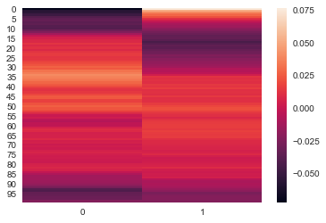

DataGeometry objects (``geo``)
==============================

The DataGeometry object is the hypertools data object class. A ``geo``
contains the data, figure handles, and transform functions used to
create a plot. Note that this class should not be called directly, but
is used by the hyp.plot function to create a plot object.

In this tutorial we will explore the features of a geo and how it may be
used.

Import Hypertools
-----------------

.. code:: ipython3

    import hypertools as hyp
    import seaborn as sb
    
    %matplotlib inline

Load your data
--------------

In this case, we have used one of the sample datasets built into the
package.

.. code:: ipython3

    geo = hyp.load('mushrooms')

Plot it
-------

We can plot a ``geo`` by calling the plot method

.. code:: ipython3

    geo.plot()

.. parsed-literal::

    <hypertools.datageometry.DataGeometry at 0x10d304f28>

Exploring the geo
-----------------

Hypertools version
~~~~~~~~~~~~~~~~~~

The version field contains the version number of hypertools that the geo
was generated with.

.. code:: ipython3

    geo.version

.. parsed-literal::

    '0.5.0'

Data and plot
~~~~~~~~~~~~~

The data field contains the raw data.

.. code:: ipython3

    geo.data.head()

.. raw:: html

    

    
    <table border="1" class="dataframe">
      <thead>
        <tr style="text-align: right;">
          <th></th>
          <th>bruises</th>
          <th>cap-color</th>
          <th>cap-shape</th>
          <th>cap-surface</th>
          <th>gill-attachment</th>
          <th>gill-color</th>
          <th>gill-size</th>
          <th>gill-spacing</th>
          <th>habitat</th>
          <th>odor</th>
          <th>...</th>
          <th>ring-type</th>
          <th>spore-print-color</th>
          <th>stalk-color-above-ring</th>
          <th>stalk-color-below-ring</th>
          <th>stalk-root</th>
          <th>stalk-shape</th>
          <th>stalk-surface-above-ring</th>
          <th>stalk-surface-below-ring</th>
          <th>veil-color</th>
          <th>veil-type</th>
        </tr>
      </thead>
      <tbody>
        <tr>
          <th>0</th>
          <td>t</td>
          <td>n</td>
          <td>x</td>
          <td>s</td>
          <td>f</td>
          <td>k</td>
          <td>n</td>
          <td>c</td>
          <td>u</td>
          <td>p</td>
          <td>...</td>
          <td>p</td>
          <td>k</td>
          <td>w</td>
          <td>w</td>
          <td>e</td>
          <td>e</td>
          <td>s</td>
          <td>s</td>
          <td>w</td>
          <td>p</td>
        </tr>
        <tr>
          <th>1</th>
          <td>t</td>
          <td>y</td>
          <td>x</td>
          <td>s</td>
          <td>f</td>
          <td>k</td>
          <td>b</td>
          <td>c</td>
          <td>g</td>
          <td>a</td>
          <td>...</td>
          <td>p</td>
          <td>n</td>
          <td>w</td>
          <td>w</td>
          <td>c</td>
          <td>e</td>
          <td>s</td>
          <td>s</td>
          <td>w</td>
          <td>p</td>
        </tr>
        <tr>
          <th>2</th>
          <td>t</td>
          <td>w</td>
          <td>b</td>
          <td>s</td>
          <td>f</td>
          <td>n</td>
          <td>b</td>
          <td>c</td>
          <td>m</td>
          <td>l</td>
          <td>...</td>
          <td>p</td>
          <td>n</td>
          <td>w</td>
          <td>w</td>
          <td>c</td>
          <td>e</td>
          <td>s</td>
          <td>s</td>
          <td>w</td>
          <td>p</td>
        </tr>
        <tr>
          <th>3</th>
          <td>t</td>
          <td>w</td>
          <td>x</td>
          <td>y</td>
          <td>f</td>
          <td>n</td>
          <td>n</td>
          <td>c</td>
          <td>u</td>
          <td>p</td>
          <td>...</td>
          <td>p</td>
          <td>k</td>
          <td>w</td>
          <td>w</td>
          <td>e</td>
          <td>e</td>
          <td>s</td>
          <td>s</td>
          <td>w</td>
          <td>p</td>
        </tr>
        <tr>
          <th>4</th>
          <td>f</td>
          <td>g</td>
          <td>x</td>
          <td>s</td>
          <td>f</td>
          <td>k</td>
          <td>b</td>
          <td>w</td>
          <td>g</td>
          <td>n</td>
          <td>...</td>
          <td>e</td>
          <td>n</td>
          <td>w</td>
          <td>w</td>
          <td>e</td>
          <td>t</td>
          <td>s</td>
          <td>s</td>
          <td>w</td>
          <td>p</td>
        </tr>
      </tbody>
    </table>
    
5 rows × 22 columns

    

Transformed data
~~~~~~~~~~~~~~~~

The ``xform_data`` field contains the data that have been transformed
according to the user-specified normalize, reduce, and align options (in
this case, the data was automatically reduced to 3 dimensions for
plotting when we called ``hyp.plot``).

.. code:: ipython3

    geo.xform_data

.. parsed-literal::

    [array([[ 1.30060679,  0.29575138, -1.12870127],
            [ 1.36815474, -0.28876648, -1.82066942],
            [ 1.59220727, -0.26813075, -1.66586137],
            ...,
            [ 0.40863473,  0.12762486, -0.41712925],
            [-0.89420121,  1.72874308,  0.56553812],
            [ 0.38848708,  0.10733461, -0.58634345]])]

Normalize, reduce and align metadata
~~~~~~~~~~~~~~~~~~~~~~~~~~~~~~~~~~~~

The ``reduce``, ``align`` and ``normalize`` fields contain information
about the model and parameters used in each of the analyses.

The reduce and align fields contain dictionaries with the model
information and the normalize field contains a string.

.. code:: ipython3

    print(geo.normalize)
    print(geo.reduce)
    print(geo.align)

.. parsed-literal::

    None
    {'params': {'n_components': 3}, 'model': 'IncrementalPCA'}
    {'model': None, 'params': {}}

Plotting axes and animations
~~~~~~~~~~~~~~~~~~~~~~~~~~~~

The ``ax`` and ``line_ani`` fields hold the plot axes and the animation
setting (in this case None) for plotting, respectively.

To read more about the plot axes and line animation objects and their
utility, see the matlplotlib documentation for
`axes <http://matplotlib.org/api/axes_api.html>`__ and
`animations <http://matplotlib.org/api/animation_api.html>`__,
respectively.

.. code:: ipython3

    geo.ax

.. code:: ipython3

    geo.line_ani

Plotting with geos
------------------

You can also generate a new plot (a new geo) from data stored in the geo
using geo.plot.

This plotting feature accepts all of the keyword arguments supported by
hypertools.plot.

First, let's plot without making any changes.

.. code:: ipython3

    geo.plot()

.. parsed-literal::

    <hypertools.datageometry.DataGeometry at 0x10d60d390>

Now, let's change the plot using some keyword arguments.

In the example below, the data are re-transformed using all of the same
options as in the original plot, but with the number of dimensions
specified by the reduce model set to 2.

.. code:: ipython3

    geo.plot(ndims = 2)

.. parsed-literal::

    <hypertools.datageometry.DataGeometry at 0x10d8d5a20>

Tranforming data using geos
---------------------------

An additional feature afforded by geos is the ability to later analyze
other datasets using the same transformations performed on the original
data in the geo. That is, whatever normalization, alignment, and
reduction parameters were used on the original data in the geo can be
quickly and easily applied to any new dataset using a single line of
code!

This allows for easy comparison of multiple datasets. Here, we load a
built in dataset (the weights dataset) and apply the transform from the
geo data to the first element of weights.

.. code:: ipython3

    weights = hyp.load('weights_avg').get_data()
    transformed = geo.transform(weights)

We can use heatmaps to visualized an element of the new data before and
after it has been transformed by the same means as the geo data.

.. code:: ipython3

    ax = sb.heatmap(weights[0])

.. code:: ipython3

    ax = sb.heatmap(transformed[0])

Saving geos
-----------

You can also easily save a geo using geo.save. The geo will save as a
'geo' file, which is a dictionary containing the elements of a data
geometry object saved in the hd5 format using deepdish.

To specify the compression type, pass a string to the compression
argument, as below. See the deepdish documentation for the full list of
compression options:
http://deepdish.readthedocs.io/en/latest/api\_io.html#deepdish.io.save

.. code:: ipython3

    # geo.save('MyGeoFile')
    # geo.save('MyGeoFile', compression = 'blosc')
