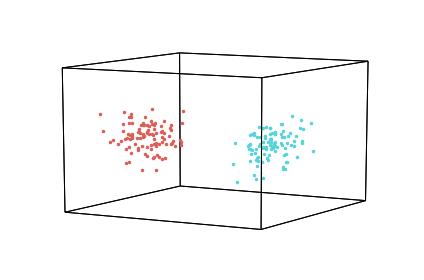
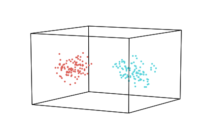
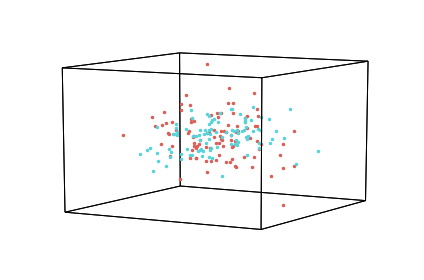
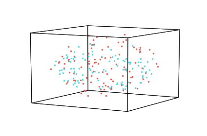

Normalization
=============

The ``normalize`` is a helper function to z-score your data. This is
useful if your features (columns) are scaled differently within or
across datasets. By default, hypertools normalizes *across* the columns
of all datasets passed, but also affords the option to normalize columns
*within* individual lists. Alternatively, you can also normalize each
row. The function returns an array or list of arrays where the columns
or rows are z-scored (output type same as input type).

Import packages
---------------

.. code:: ipython3

    import hypertools as hyp
    import numpy as np
    
    %matplotlib inline

Generate synthetic data
-----------------------

First, we generate two sets of synthetic data. We pull points randomly
from a multivariate normal distribution for each set, so the sets will
exhibit unique statistical properties.

.. code:: ipython3

    x1 = np.random.randn(10,10)
    x2 = np.random.randn(10,10)
    
    c1 = np.dot(x1, x1.T)
    c2 = np.dot(x2, x2.T)
    
    m1 = np.zeros([1,10])
    m2 = 10 + m1
    
    data1 = np.random.multivariate_normal(m1[0], c1, 100)
    data2 = np.random.multivariate_normal(m2[0], c2, 100)
    
    data = [data1, data2]

Visualize the data
------------------

.. code:: ipython3

    geo = hyp.plot(data, '.')

Normalizing (Specified Cols or Rows)
------------------------------------

Or, to specify a different normalization, pass one of the following
arguments as a string, as shown in the examples below.

-  'across' - columns z-scored across passed lists (default)
-  'within' - columns z-scored within passed lists
-  'row' - rows z-scored

Normalizing 'across'
~~~~~~~~~~~~~~~~~~~~

When you normalize 'across', all of the data is stacked/combined, and
the normalization is done on the columns of the full dataset. Then the
data is split back into separate elements.

.. code:: ipython3

    norm = hyp.normalize(data, normalize = 'across')
    geo = hyp.plot(norm, '.')

Normalizing 'within'
~~~~~~~~~~~~~~~~~~~~

When you normalize 'within', normalization is done on the columns of
each element of the data, separately.

.. code:: ipython3

    norm = hyp.normalize(data, normalize = 'within')
    geo = hyp.plot(norm, '.')

Normalizing by 'row'
~~~~~~~~~~~~~~~~~~~~

.. code:: ipython3

    norm = hyp.normalize(data, normalize = 'row')
    geo = hyp.plot(norm, '.')

