Plotting
========

Nearly all of the ``hypertools`` functionality may be accessed through
the main ``plot`` function. This design enables complex data analysis,
data manipulation, and plotting to be carried out in a single function
call. To use it, simply pass your samples by features dataset(s) [in the
form of a numpy array, pandas dataframe, or (mixed) list] to the
``plot`` function. Let's explore!

Import Hypertools and other libraries for tutorial
--------------------------------------------------

.. code:: ipython3

    import hypertools as hyp
    import numpy as np
    import scipy
    import pandas as pd
    from scipy.linalg import toeplitz
    from copy import copy
    
    %matplotlib inline

Load your data
--------------

We will load one of the sample datasets. This dataset consists of 8,124
samples of mushrooms with various text features.

.. code:: ipython3

    mushrooms = hyp.load('mushrooms')

We can peek at the first few rows of the dataframe using the pandas
function ``head()``.

.. code:: ipython3

    mushrooms.head()

.. raw:: html

    

    <table border="1" class="dataframe">
      <thead>
        <tr style="text-align: right;">
          <th></th>
          <th>class</th>
          <th>cap-shape</th>
          <th>cap-surface</th>
          <th>cap-color</th>
          <th>bruises</th>
          <th>odor</th>
          <th>gill-attachment</th>
          <th>gill-spacing</th>
          <th>gill-size</th>
          <th>gill-color</th>
          <th>...</th>
          <th>stalk-surface-below-ring</th>
          <th>stalk-color-above-ring</th>
          <th>stalk-color-below-ring</th>
          <th>veil-type</th>
          <th>veil-color</th>
          <th>ring-number</th>
          <th>ring-type</th>
          <th>spore-print-color</th>
          <th>population</th>
          <th>habitat</th>
        </tr>
      </thead>
      <tbody>
        <tr>
          <th>0</th>
          <td>p</td>
          <td>x</td>
          <td>s</td>
          <td>n</td>
          <td>t</td>
          <td>p</td>
          <td>f</td>
          <td>c</td>
          <td>n</td>
          <td>k</td>
          <td>...</td>
          <td>s</td>
          <td>w</td>
          <td>w</td>
          <td>p</td>
          <td>w</td>
          <td>o</td>
          <td>p</td>
          <td>k</td>
          <td>s</td>
          <td>u</td>
        </tr>
        <tr>
          <th>1</th>
          <td>e</td>
          <td>x</td>
          <td>s</td>
          <td>y</td>
          <td>t</td>
          <td>a</td>
          <td>f</td>
          <td>c</td>
          <td>b</td>
          <td>k</td>
          <td>...</td>
          <td>s</td>
          <td>w</td>
          <td>w</td>
          <td>p</td>
          <td>w</td>
          <td>o</td>
          <td>p</td>
          <td>n</td>
          <td>n</td>
          <td>g</td>
        </tr>
        <tr>
          <th>2</th>
          <td>e</td>
          <td>b</td>
          <td>s</td>
          <td>w</td>
          <td>t</td>
          <td>l</td>
          <td>f</td>
          <td>c</td>
          <td>b</td>
          <td>n</td>
          <td>...</td>
          <td>s</td>
          <td>w</td>
          <td>w</td>
          <td>p</td>
          <td>w</td>
          <td>o</td>
          <td>p</td>
          <td>n</td>
          <td>n</td>
          <td>m</td>
        </tr>
        <tr>
          <th>3</th>
          <td>p</td>
          <td>x</td>
          <td>y</td>
          <td>w</td>
          <td>t</td>
          <td>p</td>
          <td>f</td>
          <td>c</td>
          <td>n</td>
          <td>n</td>
          <td>...</td>
          <td>s</td>
          <td>w</td>
          <td>w</td>
          <td>p</td>
          <td>w</td>
          <td>o</td>
          <td>p</td>
          <td>k</td>
          <td>s</td>
          <td>u</td>
        </tr>
        <tr>
          <th>4</th>
          <td>e</td>
          <td>x</td>
          <td>s</td>
          <td>g</td>
          <td>f</td>
          <td>n</td>
          <td>f</td>
          <td>w</td>
          <td>b</td>
          <td>k</td>
          <td>...</td>
          <td>s</td>
          <td>w</td>
          <td>w</td>
          <td>p</td>
          <td>w</td>
          <td>o</td>
          <td>e</td>
          <td>n</td>
          <td>a</td>
          <td>g</td>
        </tr>
      </tbody>
    </table>
    
5 rows × 23 columns

    

Plot with default settings
--------------------------

``Hypertools`` can plot your high-dimensional data quickly and easily
with little user-generated input. By default, ``hypertools``
automatically reduces your data via incremental principal component
analysis (if dimensions > 3) and plots plots a 3D line plot where the
axes represent the top 3 principal components of the dataset.

.. code:: ipython3

    geo = hyp.plot(mushrooms) # plots a line

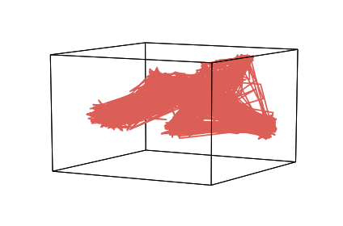

By default, hypertools assumes you are passing in a timeseries, and so
it plots a trajectory of the data evolving over time. If you aren't
visualizing a timeseries, you can instead plot the individual
observations as dots or other symbols by specifying an appropriate
format style.

To show the individual points, simply pass the ``'.'`` format string in
the second argument position, or in any position using ``fmt='.'``; the
format string is parsed by `matplotlib <http://matplotlib.org/>`__.

.. code:: ipython3

    geo = hyp.plot(mushrooms, '.') # plots dots

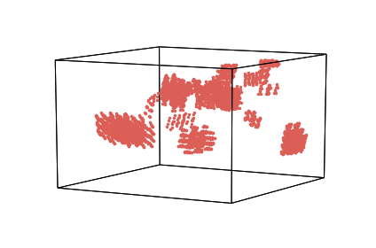

.. code:: ipython3

    geo = hyp.plot(mushrooms, fmt = 'b*') # plots blue asterisks

.. image:: plot_files/plot_13_0.png

Plot in 2D
----------

We can also opt to plot high dimensional data in two dimensional space,
rather than 3D, by passing the ``ndims`` argument.

.. code:: ipython3

    geo = hyp.plot(mushrooms, '.', ndims=2)

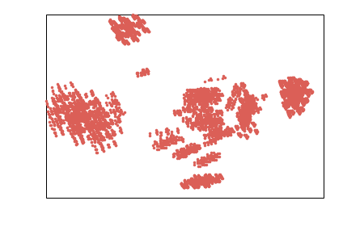

Using other dimensionality reduction algorithms
-----------------------------------------------

To explore a data reduction method aside from the default (PCA), use
``reduce`` argument. Here, we pass the reduce argument a string.

Other supported reduction models include: PCA, IncrementalPCA,
SparsePCA, MiniBatchSparsePCA, KernelPCA, FastICA, FactorAnalysis,
TruncatedSVD, DictionaryLearning, MiniBatchDictionaryLearning, TSNE,
Isomap, SpectralEmbedding, LocallyLinearEmbedding, MDS

.. code:: ipython3

    geo = hyp.plot(mushrooms, '.', reduce='SparsePCA')

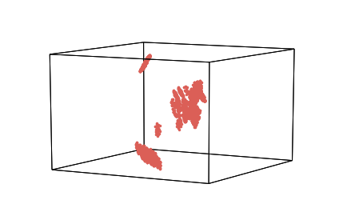

Parameter Specifications
~~~~~~~~~~~~~~~~~~~~~~~~

For finer control of the parameters, you can pass the reduce argument a
dictionary (see scikit learn documentation about parameter options for
specific reduction techniques).

.. code:: ipython3

    geo = hyp.plot(mushrooms, '.', reduce={'model' : 'PCA', 'params' : {'whiten' : True}})

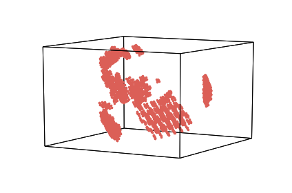

Coloring by group
-----------------

To color your datapoints by group labels, pass the ``group`` argument.
It accepts strings, ints, and floats, or a list of these. You must pass
group the same number of labels as you have rows in your data matrix.

Here, we group the data in five different chunks of equal size (size
#points / 5) for simplicity. Note that we pass ints, strings, floats,
and None in the same list to the group argument.

.. code:: ipython3

    split = int(mushrooms.shape[0]/ 5)
    groupings = [1]*split + ['two']*split + [3.0]*split + [None]*split + ['four']*split
    geo_group = hyp.plot(mushrooms, '.', group=groupings)

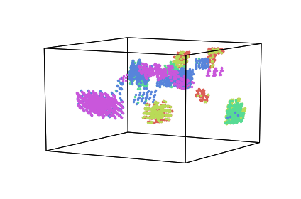

Adding a legend
~~~~~~~~~~~~~~~

When coloring by group, you may want a legend to indicate group type.
Passing ``legend=True`` will generate the legend based on your
groupings.

.. code:: ipython3

    split = int(mushrooms.shape[0]/5)
    groupings = [1]*split + ['two']*split + [3.0]*split + [None]*split + ['four']*split
    geo_group = hyp.plot(mushrooms, '.', group=groupings, legend=True)

Interpolating missing data
--------------------------

Missing data points? No problem! ``Hypertools`` will fill missing values
via probabalistic principal components analysis (PPCA). Here, we
generate a small synthetic dataset, remove a few values, then use PPCA
to infer those missing values. Then, we plot the original data and the
interpolated data, for comparison. The one exception is that in cases
where the entire data sample (row) is nans. In this scenario, there is
no data for PPCA to base its guess on, so the inference will fail.

.. code:: ipython3

    # simulate data
    K = 10 - toeplitz(np.arange(10))
    data1 = np.cumsum(np.random.multivariate_normal(np.zeros(10), K, 250), axis=0)
    data2 = copy(data1)
    
    # randomly remove 5% of the data
    missing = .01
    inds = [(i,j) for i in range(data1.shape[0]) for j in range(data1.shape[1])]
    missing_data = [inds[i] for i in np.random.choice(int(len(inds)), int(len(inds)*missing))]
    for i,j in missing_data:
        data2[i,j]=np.nan
    
    # reduce the data
    data1_r,data2_r = hyp.reduce([data1, data2], ndims=3)
    
    # pull out missing inds
    missing_inds = hyp.tools.missing_inds(data2)
    missing_data = data2_r[missing_inds, :]
    
    # plot
    geon_nan = hyp.plot([data1_r, data2_r, missing_data], ['-', '--', '*'],
             legend=['Full', 'Missing', 'Missing Points'])

.. parsed-literal::

    /Users/andyheusser/Documents/github/hypertools/hypertools/_shared/helpers.py:206: UserWarning: Missing data: Inexact solution computed with PPCA (see https://github.com/allentran/pca-magic for details)
      warnings.warn('Missing data: Inexact solution computed with PPCA (see https://github.com/allentran/pca-magic for details)')

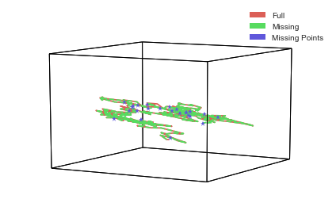

Labeling plotted points
-----------------------

The ``labels`` argument accepts a list of labels for each point, which
must be the same length as the data (the number of rows). If no label is
wanted for a particular point, simply input ``None``. In this example,
we have made use of ``None`` in order to label only three points of
interest (the first, second, and last in our set).

.. code:: ipython3

    num_unlabeled = int(mushrooms.shape[0])-3
    labeling = ['a','b'] + [None]*num_unlabeled + ['c']
    label = hyp.plot(mushrooms, '.', labels = labeling)

Data Clustering
---------------

Hypertools can also auto-cluster your datapoints with the ``n_clusters``
argument. To implement, simply set ``n_clusters`` to an integer.

.. code:: ipython3

    geo_cluster = hyp.plot(mushrooms, '.', n_clusters = 6)

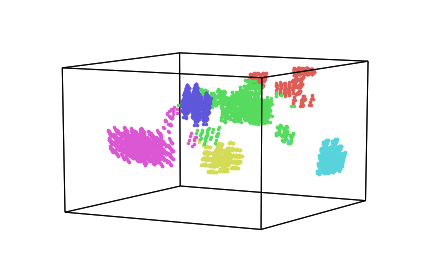

Normalization
-------------

For quick, easy data normalization of the input data, pass the normalize
argument.

You can pass the following arguments as strings: + across - columns
z-scored across lists (default) + within - columns z-scored within each
list + row - each row z-scored

.. code:: ipython3

    geo_cluster = hyp.plot(mushrooms, '.', normalize = 'within')

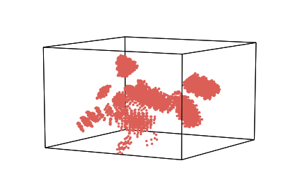

Aligning datasets with different coordinate systems
---------------------------------------------------

You can also align multiple datasets using the hypertools plot function
in order to visualize data in a common space. This is useful, if you
have more than one high-dimensional dataset that is related to the same
thing. For example, consider a brain imaging (fMRI) dataset comprised of
multiple subjects watching the same movie. Voxel A in subject 1 may not
necessarily be Voxel A in subject 2. Alignment allows you to rotate and
scale multiple datasets so they are in maximal alignment with one
another.

To do so, pass one of the following strings to the align argument (as
shown below):

-  ``hyper`` - hyperalignment algorithm (default) See:
   http://haxbylab.dartmouth.edu/publications/HGC+11.pdf
-  ``SRM`` - shared response model algorithm. See:
   https://papers.nips.cc/paper/5855-a-reduced-dimension-fmri-shared-response-model.pdf

Below, is a simple example of a spiral.

.. code:: ipython3

    # load example data
    data = hyp.load('spiral')
    target = data.copy()
    
    # a random rotation matrix
    rot = scipy.linalg.orth(np.random.rand(3,3))
    
    # creating new spiral with some noise
    source = np.dot(target, rot)
    
    # before hyperalignment
    before = hyp.plot([target, source], ['-','--'], title='Before alignment')
    
    # after hyperalignment
    after = hyp.plot([target, source], ['-','--'], align='hyper', title='After alignment')

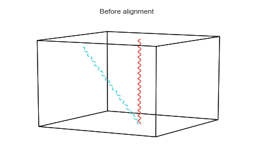

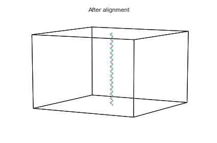

Saving
------

To save a plot created with hypertools, simply pass the ``save_path``
argument.

.. code:: ipython3

    # geo_cluster = hyp.plot(mushrooms, '.', save_path='cluster_plot.pdf')
