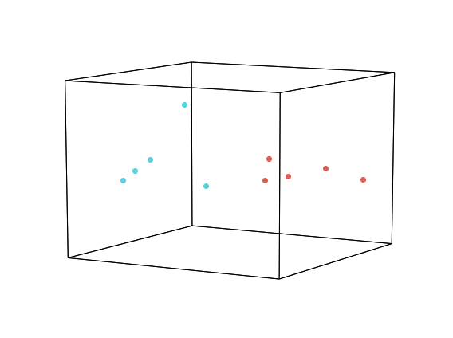
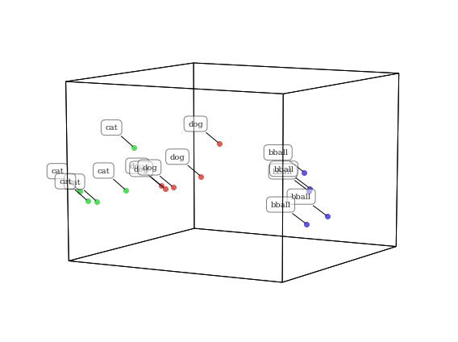
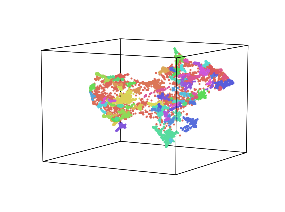
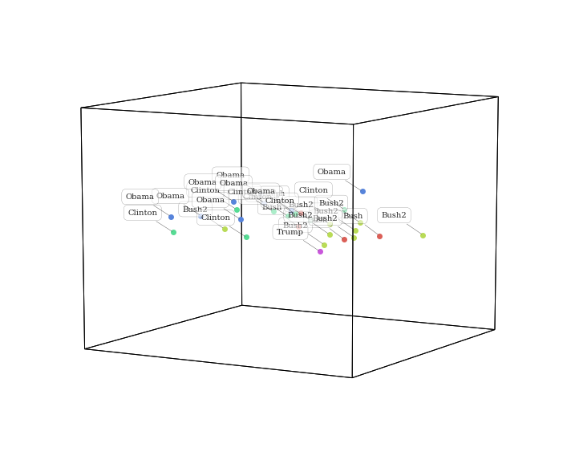
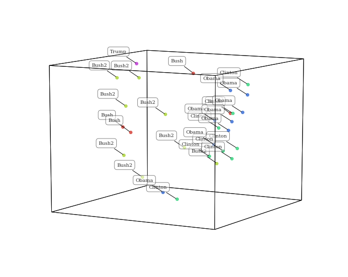
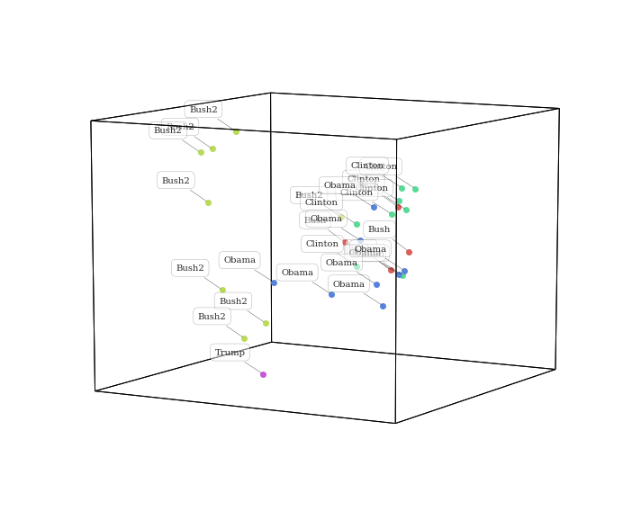
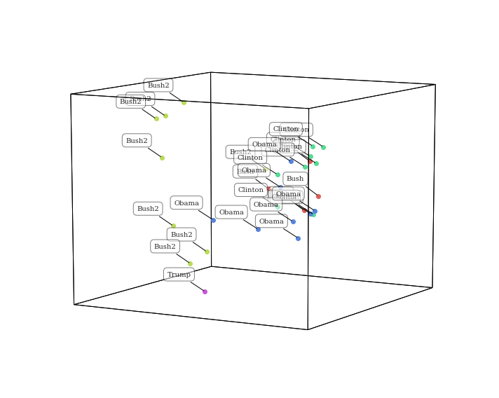

Visualizing text
================

.. code:: ipython2

    import hypertools as hyp
    import wikipedia as wiki
    %matplotlib inline

In this example, we will download some text from wikipedia, split it up
into chunks and then plot it. We will use the wikipedia package to
retrieve the wiki pages for 'dog' and 'cat'.

.. code:: ipython2

    def chunk(s, count):
        return [''.join(x) for x in zip(*[list(s[z::count]) for z in range(count)])]
    
    chunk_size = 5
    
    dog_text = wiki.page('Dog').content
    cat_text = wiki.page('Cat').content
    
    dog = chunk(dog_text, int(len(dog_text)/chunk_size))
    cat = chunk(cat_text, int(len(cat_text)/chunk_size))

Below is a snippet of some of the text from the dog wikipedia page. As
you can see, the word dog appears in many of the sentences, but also
words related to dog like wolf and carnivore appear.

.. code:: ipython2

    dog[0][:1000]

.. parsed-literal::

    u'The domestic dog (Canis lupus familiaris or Canis familiaris) is a member of the genus Canis (canines), which forms part of the wolf-like canids, and is the most widely abundant terrestrial carnivore. The dog and the extant gray wolf are sister taxa as modern wolves are not closely related to the wolves that were first domesticated, which implies that the direct ancestor of the dog is extinct. The dog was the first species to be domesticated and has been selectively bred over millennia for various behaviors, sensory capabilities, and physical attributes.\nTheir long association with humans has led dogs to be uniquely attuned to human behavior and they are able to thrive on a starch-rich diet that would be inadequate for other canid species. New research seems to show that dogs have mutations to equivalent genetic regions in humans where changes are known to trigger high sociability and somewhat reduced intelligence. Dogs vary widely in shape, size and colors. Dogs perform many roles for'

Now we will simply pass the text samples as a list to ``hyp.plot``. By
default hypertools will transform the text data using a topic model that
was fit on a variety of wikipedia pages. Specifically, the text is
vectorized using the scikit-learn ``CountVectorizer`` and then passed on
to a ``LatentDirichletAllocation`` to estimate topics. As can be seen
below, the 5 chunks of text from the dog/cat wiki pages cluster
together, suggesting they are made up of distint topics.

.. code:: ipython2

    hue=['dog']*chunk_size+['cat']*chunk_size
    geo = hyp.plot(dog + cat, 'o', hue=hue, size=[8, 6])

Now, let's add a third very different topic to the plot.

.. code:: ipython2

    bball_text = wiki.page('Basketball').content
    bball = chunk(bball_text, int(len(bball_text)/chunk_size))
    
    hue=['dog']*chunk_size+['cat']*chunk_size+['bball']*chunk_size
    geo = hyp.plot(dog + cat + bball, 'o', hue=hue, labels=hue, size=[8, 6])

As you might expect, the cat and dog text chunks are closer to each
other than to basketball in this topic space. Since cats and dogs are
both animals, they share many more features (and thus are described with
similar text) than basketball.

Visualizing NIPS papers
-----------------------

The next example is a dataset of all NIPS papers published from 1987.
They are fit and transformed using the text from each paper. This
example dataset can be loaded using the code below.

.. code:: ipython2

    nips = hyp.load('nips')
    nips.plot(size=[8, 6])

.. parsed-literal::

    <hypertools.datageometry.DataGeometry at 0x10ebe1750>

Visualizing Wikipedia pages
---------------------------

Here, we will plot a collection of wikipedia pages, transformed using a
topic model (the default 'wiki' model) that was fit on the same
articles. We will reduce the dimensionality of the data with TSNE, and
then discover cluster with the 'HDBSCAN' algorithm.

.. code:: ipython2

    wiki = hyp.load('wiki')
    wiki.plot(size=[8, 6])

.. parsed-literal::

    <hypertools.datageometry.DataGeometry at 0x11db6e790>

Visualizing State of the Union Addresses
----------------------------------------

In this example we will plot each state of the union address from 1989
to present. The dots are colored and labeled by president. The semantic
model that was used to transform is the default 'wiki' model, which is a
CountVectorizer->LatentDirichletAllocation pipeline fit with a selection
of wikipedia pages. As you can see below, the points generally seem to
cluster by president, but also by party affiliation (democrats mostly on
the left and republicans mostly on the right).

.. code:: ipython2

    sotus = hyp.load('sotus')
    sotus.plot(size=[10,8])

.. parsed-literal::

    <hypertools.datageometry.DataGeometry at 0x117e040d0>

Changing the reduction model
----------------------------

These data are reduce with PCA. Want to visualize using a different
algorithm? Simply change the ``reduce`` parameter. This gives a
different, but equally interesting lower dimensional representation of
the data.

.. code:: ipython2

    sotus.plot(reduce='UMAP', size=[10, 8])

.. parsed-literal::

    <hypertools.datageometry.DataGeometry at 0x11bf57610>

Defining a corpus
-----------------

Now let's change the corpus used to train the text model. Specifically,
we'll use the 'nips' text, a collection of scientific papers. To do
this, set ``corpus='nips'``. You can also specify your own text (as a
list of text samples) to train the model.

.. code:: ipython2

    sotus.plot(reduce='UMAP', corpus='nips', size=[10, 8])

.. parsed-literal::

    <hypertools.datageometry.DataGeometry at 0x11c0cf210>

Interestingly, plotting the data transformed by a different topic model
(trained on scientific articles) gives a totally different
representation of the data. This is because the themes extracted from a
homogenous set of scientific articles are distinct from the themes
extract from diverse set of wikipedia articles, so the transformation
function will be unique.
