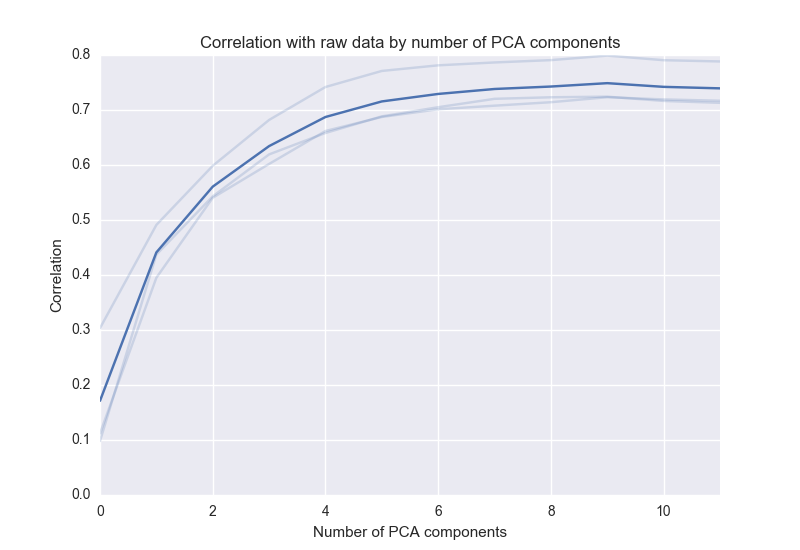

<h1>Hypertools - A python package for visualizing high dimensional data</h1>


<h2>Install</h2>

To install from this repo, navigate to this folder in Terminal and type:

pip install -e .

(this assumes you have pip installed on your system: https://pip.pypa.io/en/stable/installing/)

Coming soon: `pip install hypertools`

<h2>Main function</h2>

+ <b>plot</b> - plots multidimensional data as static image or movie

<h2>Sub functions</h2>

+ <b>util.align</b> - align multidimensional data (See here for details)
+ <b>util.reduce</b> - implements PCA to reduce dimensionality of data
+ <b>util.describe_pca</b> - plotting tool to evaluate how well the principle components describe the data
+ <b>util.missing_inds</b> - function that returns indices of missing data (nans)

<h2>Plot</h2>


<b>Inputs:</b>

A numpy array, or list of arrays

<b>Arguments:</b>

Format strings can be passed as a string, or tuple/list of length x.
See matplotlib API for more styling options

<b>Keyword arguments:</b>

<i>animate</i> (bool): If True, plots the data as an animated trajectory

<i>save_path</i> (str): Path to save the image/movie.  Must include the file extension in the save path (i.e. `save_path='/path/to/file/image.png'`).  NOTE: If saving an animation, FFMPEG must be installed (this is a matplotlib req).

<i>palette</i> (str): A matplotlib or seaborn color palette

<i>color</i> (list): A list of colors for each line to be plotted. Can be named colors, RGB values (e.g. (.3, .4, .1)) or hex codes. If defined, overrides palette. See http://matplotlib.org/examples/color/named_colors.html for list of named colors. Note: must be the same length as X.

<i>point_colors</i> (list of str, floats or ints): A list of colors for each point. Must be dimensionality of data (X). If the data type is numerical, the values will be mapped to rgb values in the specified palette.  If the data type is strings, the points will be labeled categorically.

<i>linestyle</i> (list): a list of line styles

<i>marker</i> (list): a list of marker types

<i>ndims</i> (int): an int representing the number of dims to plot in. Must be 1,2, or 3.  NOTE: Currently only works with static plots.

See matplotlib API for more styling options

<i>labels</i> (list): A list of labels for each point. Must be dimensionality of data (X). If no label is wanted for a particular point, input `None`

<i>explore</i> (bool): Displays user defined labels or PCA coordinates on hover. When a point is clicked, the label will remain on the plot (dataarning: experimental feature, use at your own discretion!). To use, set `explore=True`.

<h3>Example uses</h3>

Import the library: `import hypertools as hyp`

Plot with default color palette: `hyp.plot(data)`

Plot as movie: `hyp.plot(data, animate=True)`

Change color palette: `hyp.plot(data,palette='Reds')`

Specify colors using unlabeled list of format strings: `hyp.plot([data[0],data[1]],['r:','b--'])`

Plot data as points: `hyp.plot([data[0],data[1]],'o')`

Specify colors using keyword list of colors (color codes, rgb values, hex codes or a mix): `hyp.plot([data[0],data[1],[data[2]],color=['r', (.5,.2,.9), '#101010'])`

Specify linestyles using keyword list: `hyp.plot([data[0],data[1],[data[2]],linestyle=[':','--','-'])`

Specify markers using keyword list: `hyp.plot([data[0],data[1],[data[2]],marker=['o','*','^'])`

Specify markers with format string and colors with keyword argument: `hyp.plot([data[0],data[1],[data[2]], 'o', color=['r','g','b'])`

Specify labels:
```
# Label first point of each list
labels=[]
for idx,i in enumerate(data):
    tmp=[]
    for iidx,ii in enumerate(i):
        if iidx==0:
            tmp.append('Point ' + str(idx))
        else:
            tmp.append(None)
    labels.append(tmp)

hyp.plot(data, 'o', labels=labels)
```

Specify point_colors:
```
# Label first point of each list
point_colors=[]
for idx,i in enumerate(data):
    tmp=[]
    for iidx,ii in enumerate(i):
            tmp.append(np.random.rand())
    point_colors.append(tmp)

hyp.plot(data, 'o', point_colors=point_colors)
```

Turn on explore mode (experimental): `hyp.plot(data, 'o', explore=True)`

<h2>Align</h2>

<h3><center>BEFORE</center></h3>


<h3><center>AFTER</center></h3>


<b>Inputs:</b>

A list of numpy arrays

<b>Outputs</b>

An aligned list of numpy arrays

<h3>Example uses</h3>

align a list of arrays: `aligned_data = hyp.util.align(data)`

<h2>Reduce</h2>

<b>Inputs:</b>

A numpy array or list of numpy arrays

<b>Keyword arguments:</b>

ndims - dimensionality of output data

<b>Outputs</b>

An aligned list of numpy arrays

<h3>Example uses</h3>

Reduce n-dimensional array to 3d: `aligned_data = hyp.util.align(data, ndims=3)`

<h2>Describe PCA</h2>

<b>Inputs:</b>

A numpy array or list of numpy arrays

<b>Outputs</b>

A plot summarizing the correlation between raw input data and PCA reduced data

<h3>Example uses</h3>

`hyp.util.describe_pca(data)`


