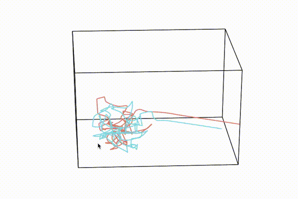
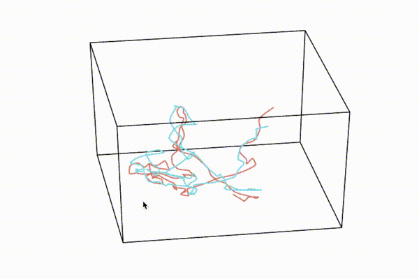
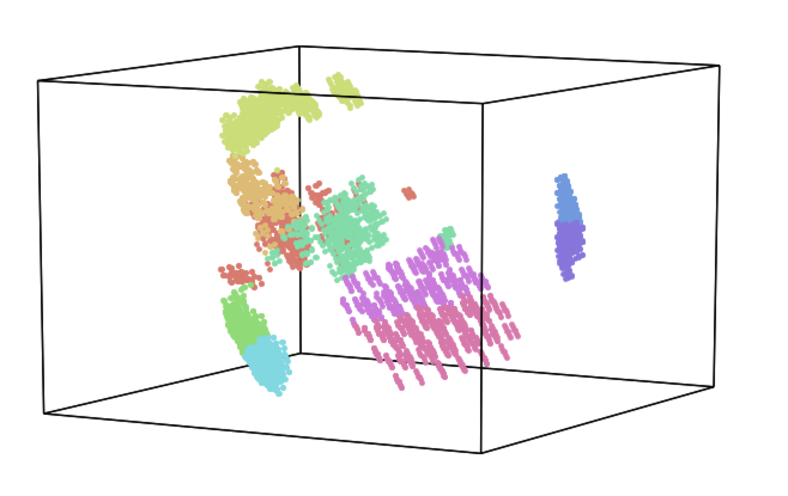
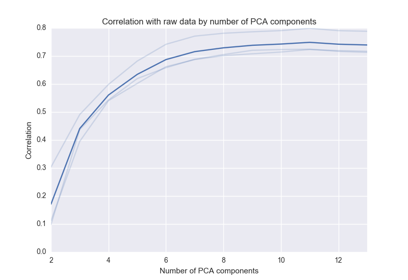

[](https://travis-ci.com/ContextLab/hypertools)


"_To deal with hyper-planes in a 14 dimensional space, visualize a 3D space and say 'fourteen' very loudly.  Everyone does it._" - Geoff Hinton


<h2>Installation</h2>

`pip install hypertools`

or

To install from this repo:

`git clone https://github.com/ContextLab/hypertools.git`

Then, navigate to the folder and type:

`pip install -e .`

(this assumes you have pip installed on your system: https://pip.pypa.io/en/stable/installing/)

<h2>Requirements</h2>

+ python 2.7.x
+ PPCA>=0.0.2
+ scikit-learn>=0.18.1
+ pandas>=0.18.0
+ seaborn>=0.7.1
+ matplotlib>=1.5.1
+ scipy>=0.17.1
+ numpy>=1.10.4
+ pytest (for development)

If installing from github (instead of pip), you must also install the requirements:
`pip install -r requirements.txt`

<h2>Contributing</h2>
(some text borrowed from Matplotlib contributing [guide](http://matplotlib.org/devdocs/devel/contributing.html))

<h3>Submitting a bug report</h3>
If you are reporting a bug, please do your best to include the following -

1. A short, top-level summary of the bug. In most cases, this should be 1-2 sentences.
2. A short, self-contained code snippet to reproduce the bug, ideally allowing a simple copy and paste to reproduce. Please do your best to reduce the code snippet to the minimum required.
3. The actual outcome of the code snippet
4. The expected outcome of the code snippet

<h3>Contributing code</h3>

The preferred way to contribute to Hypertools is to fork the main repository on GitHub, then submit a pull request.

+ If your pull request addresses an issue, please use the title to describe the issue and mention the issue number in the pull request description to ensure a link is created to the original issue.

+ All public methods should be documented in the README.

+ Each high-level plotting function should have a simple example in the examples folder. This should be as simple as possible to demonstrate the method.

+ Changes (both new features and bugfixes) should be tested using `pytest`.  Add tests for your new feature to the `tests/` repo folder.

<h1>Documentation</h1>

<h2>Main function</h2>

+ <b>plot</b> - Plots high dimensional data in 1, 2, or 3 dimensions as static image, 3d interactive plot or animated plot.

<h2>Sub functions</h2>

+ <b>tools.align</b> - align multidimensional data (See here for details)
+ <b>tools.reduce</b> - implements PCA to reduce dimensionality of data
+ <b>tools.cluster</b> - runs k-means clustering and returns cluster labels
+ <b>tools.describe_pca</b> - plotting tool to evaluate how well the principle components describe the data
+ <b>tools.missing_inds</b> - returns indices of missing data (nans)
+ <b>tools.normalize</b> - z-scores the columns/rows of a matrix or list of matrices
+ <b>tools.procrustes</b> - projects from one space to another using Procrustean
  transformation (shift + scaling + rotation) (Adapted from [pyMVPA](https://github.com/PyMVPA/PyMVPA/blob/master/mvpa2/mappers/procrustean.py) implementation)
+ <b>tools.df2mat</b> - converts single-level pandas dataframe to numpy matrix

<h2>Plot</h2>


<b>Inputs:</b>

A numpy array, list of arrays, or pandas dataframe or list of dataframes

<i><b>NOTE:</b> Hypertools currently only supports single-level indexing for pandas dataframes, but we plan to support multi-level indices in the future. Additionally, be aware that if columns containing text are passed to hypertools, those columns will be automatically converted into dummy variables (see pandas.get_dummies for details).</i>

<b>Arguments:</b>

Format strings can be passed as a string, or tuple/list of length x.
See matplotlib API for more styling options

<b>Keyword arguments:</b>

<i>color(s)</i> (list): A list of colors for each line to be plotted. Can be named colors, RGB values (e.g. (.3, .4, .1)) or hex codes. If defined, overrides palette. See http://matplotlib.org/examples/color/named_colors.html for list of named colors. Note: must be the same length as X.

<i>group</i> (list of str, floats or ints): A list of group labels. Length must match the number of rows in your dataset. If the data type is numerical, the values will be mapped to rgb values in the specified palette.  If the data type is strings, the points will be labeled categorically.  To label a subset of points, use `None` (i.e. `['a', None, 'b','a']`)

<i>linestyle(s)</i> (list): a list of line styles

<i>marker(s)</i> (list): a list of marker types

<i>palette</i> (str): A matplotlib or seaborn color palette

<i>labels</i> (list): A list of labels for each point. Must be dimensionality of data (X). If no label is wanted for a particular point, input `None`

<i>legend</i> (list): A list of string labels to be plotted in a legend (one for each list item)

<i>ndims</i> (int): an int representing the number of dims to plot in. Must be 1,2, or 3.  NOTE: Currently only works with static plots.

<i>normalize</i> (str or False) - If set to 'across', the columns of the input data will be z-scored across lists (default). If set to 'within', the columns will be z-scored within each list that is passed.  If set to 'row', each row of the input data will be z-scored.  If set to False, the input data will be returned (default is False).

<i>n_clusters</i> (int): If n_clusters is passed, hypertools will perform k-means clustering with the k parameter set to n_clusters. The resulting clusters will be plotted in different colors according to the color palette.

<i>animate</i> (bool): If True, plots the data as an animated trajectory (default: False)

<i>show</i> (bool): If set to False, the figure will not be displayed, but the figure, axis and data objects will still be returned (see Outputs) (default: True).

<i>save_path</i> (str): Path to save the image/movie.  Must include the file extension in the save path (i.e. `save_path='/path/to/file/image.png'`).  NOTE: If saving an animation, FFMPEG must be installed (this is a matplotlib req). FFMPEG can be easily installed on a mac via homebrew `brew install ffmpeg` or linux via apt-get `apt-get install ffmpeg`.  If you don't have homebrew (mac only), you can install it like this: `/usr/bin/ruby -e "$(curl -fsSL https://raw.githubusercontent.com/Homebrew/install/master/install)"`.

<i>explore</i> (bool): Displays user defined labels will appear on hover. If no labels are passed, The point index and coordinate will be plotted. To use, set `explore=True`.

Note: Explore more is currently only supported for 3D static plots.

<b>Animation-specific keyword arguments:</b>

<i>duration</i> (int): Length of the animation in seconds (default: 30 seconds)

<i>tail_duration</i> (int): Sets the length of the tail of the data (default: 2 seconds)

<i>n_rots</i> (int): Number of rotations around the box (default: 2)

<i>zoom</i> (int): Zoom, positive numbers will zoom in (default: 0)

<i>chem_trails</i> (bool): Added trail with change in opacity  (default: False)

<b>Outputs:</b>

-By default, the plot function outputs a figure handle (matplotlib.figure.Figure), axis handle (matplotlib.axes.\_axes.Axes) and data (list of numpy arrays), e.g. `fig,axis,data = hyp.plot(x)`

-If `animate=True`, the plot function additionally outputs an animation handle (matplotlib.animation.FuncAnimation) e.g. `fig,axis,data,line_ani = hyp.plot(x, animate=True)`

<h3>Example uses:</h3>

_Please see the examples folder for many more implementation examples._

Import the library: `import hypertools as hyp`

Plot with default color palette: `hyp.plot(data)`

Plot as movie: `hyp.plot(data, animate=True)`

Change color palette: `hyp.plot(data,palette='Reds')`

Specify colors using unlabeled list of format strings: `hyp.plot([data[0],data[1]],['r:','b--'])`

Plot data as points: `hyp.plot([data[0],data[1]],'o')`

Specify colors using keyword list of colors (color codes, rgb values, hex codes or a mix): `hyp.plot([data[0],data[1],[data[2]],color=['r', (.5,.2,.9), '#101010'])`

Specify linestyles using keyword list: `hyp.plot([data[0],data[1],[data[2]],linestyle=[':','--','-'])`

Specify markers using keyword list: `hyp.plot([data[0],data[1],[data[2]],marker=['o','*','^'])`

Specify markers with format string and colors with keyword argument: `hyp.plot([data[0],data[1],[data[2]], 'o', color=['r','g','b'])`

Specify labels:
```
# Label first point of each list
labels=[]
for idx,i in enumerate(data):
    tmp=[]
    for iidx,ii in enumerate(i):
        if iidx==0:
            tmp.append('Point ' + str(idx))
        else:
            tmp.append(None)
    labels.append(tmp)

hyp.plot(data, 'o', labels=labels)
```

Specify group:
```
# Label first point of each list
group=[]
for idx,i in enumerate(data):
    tmp=[]
    for iidx,ii in enumerate(i):
            tmp.append(np.random.rand())
    group.append(tmp)

hyp.plot(data, 'o', group=group)
```

Plot in 2d: `hyp.plot(data, ndims=2)`

Group clusters by color: `hyp.plot(data, n_clusters=10)`

Create a legend: `hyp.plot([data[0],data[1]], legend=['Group A', 'Group B'])`

Turn on explore mode (experimental): `hyp.plot(data, 'o', explore=True)`

<h2>Align</h2>

<h3><center>BEFORE</center></h3>



<h3><center>AFTER</center></h3>



<b>Inputs:</b>

A list of numpy arrays

<b>Outputs:</b>

An aligned list of numpy arrays

<h3>Example use:</h3>

align a list of arrays: `aligned_data = hyp.tools.align(data)`

<h2>Reduce</h2>

<b>Inputs:</b>

A numpy array or list of numpy arrays

<b>Keyword arguments:</b>

+ ndims - dimensionality of output data
+ normalize (str or False) - If set to 'across', the columns of the input data will be z-scored across lists. If set to 'within', the columns will be z-scored within each list that is passed.  If set to 'row', each row of the input data will be z-scored.  If set to False, the input data will be returned. (default is False).

<b>Outputs</b>

An array or list of arrays with reduced dimensionality

<h3>Example uses</h3>

Reduce n-dimensional array to 3d: `reduced_data = hyp.tools.reduce(data, ndims=3)`

<h2>Cluster</h2>

<b>Inputs:</b>

A numpy array or list of numpy arrays

<b>Keyword arguments:</b>

+ n_clusters (int) - number of clusters to fit (default=8)
+ ndims (int) - reduce data to ndims before running k-means (optional)

<b>Outputs</b>

A list of cluster labels corresponding to each data point.  NOTE: During the cluster fitting, the data are stacked across lists, so if multiple lists are passed, the returned list of cluster labels will need to be reshaped.

<h3>Example use:</h3>

```
cluster_labels = hyp.tools.cluster(data, n_clusters=10)
hyp.plot(data, 'o', group = cluster_labels)
```



<h2>Describe PCA</h2>

<b>Inputs:</b>

A numpy array or list of numpy arrays

<b>Keyword arguments:</b>

+ show (bool) - if true, returns figure handle, axis handle and dictionary containing the plotted data.  If false, the function just returns a dictionary containing the data

<b>Outputs</b>

A plot summarizing the correlation between raw input data and PCA reduced data

<h3>Example use:</h3>

`hyp.tools.describe_pca(data)`



<h2>Missing inds</h2>

<b>Inputs:</b>

A numpy array or list of numpy arrays

<b>Outputs</b>

A list of indices representing rows with missing data.  If a list of numpy arrays is passed, a list of lists will be returned.

<h3>Example use:</h3>

`missing_data_inds = hyp.tools.missing_inds(data)`

<h2>Normalize</h2>

<b>Inputs:</b>

A numpy array or list of numpy arrays

<b>Keyword arguments:</b>

+ normalize (str or False) - If set to 'across', the columns of the input data will be z-scored across lists. If set to 'within', the columns will be z-scored within each list that is passed.  If set to 'row', each row of the input data will be z-scored.  If set to False, the input data will be returned. Note: you MUST set the normalize flag equal to 'across', 'within' or 'row or else you will get the same data back that you put in!

<b>Outputs</b>

An array or list of normalized data

<h3>Example use:</h3>

`normalized_data = hyp.tools.normalize(data, normalize='within')`

<h2>Procrustes</h2>

<b>Inputs:</b>

- source - a numpy array to be transformed
- target - a numpy array to serve as template

<b>Outputs</b>

A (shifted + scaled + rotated) version of source that best matches target

<h3>Example use:</h3>

`source_aligned_to_target = hyp.tools.procrustes(source, target)`

<h2>df2mat</h2>

<b>Inputs:</b>

- a single-level pandas dataframe

<b>Outputs</b>

A numpy matrix built from the dataframe with text columns replaced with dummy variables (see http://pandas.pydata.org/pandas-docs/stable/generated/pandas.get_dummies.html)

<h3>Example use:</h3>

`matrix = hyp.tools.df2mat(df)`
