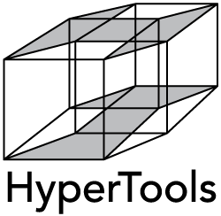
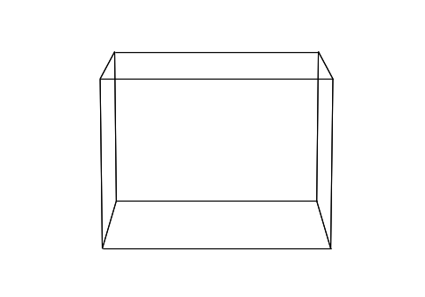
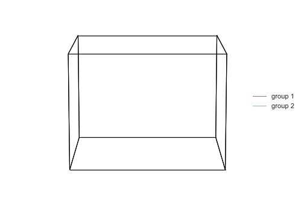
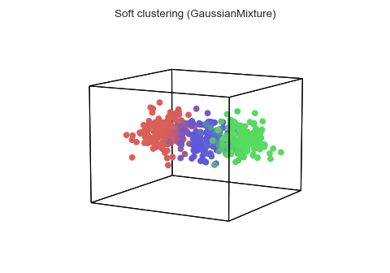
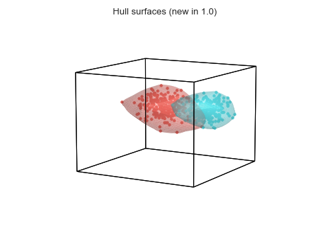
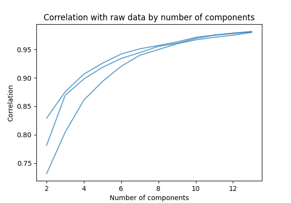

[](https://github.com/ContextLab/hypertools/actions/workflows/test.yml)
[](https://hypertools.readthedocs.io/en/latest/?badge=latest)
[](https://pypi.org/project/hypertools/)

"_To deal with hyper-planes in a 14 dimensional space, visualize a 3D space and say 'fourteen' very loudly.  Everyone does it._" - Geoff Hinton


## Overview

HyperTools is designed to facilitate
[dimensionality reduction](https://en.wikipedia.org/wiki/Dimensionality_reduction)-based
visual explorations of high-dimensional data.  The basic pipeline is
to feed in a high-dimensional dataset (or a series of high-dimensional
datasets) and, in a single function call, reduce the dimensionality of
the dataset(s) and create a plot.  The package is built atop many
familiar friends, including [matplotlib](https://matplotlib.org/),
[scikit-learn](http://scikit-learn.org/) and
[seaborn](https://seaborn.pydata.org/).  Our package was featured in 2017 on
Kaggle's now-retired "No Free Hunch" blog
([archived copy](http://web.archive.org/web/20191202152212/http://blog.kaggle.com:80/2017/04/10/exploring-the-structure-of-high-dimensional-data-with-hypertools-in-kaggle-kernels/)).
For a general overview, you may find [this talk](https://www.youtube.com/watch?v=hb_ER9RGtOM) useful (given as part of the [MIND Summer School](https://summer-mind.github.io) at Dartmouth).

## What's new in 1.0

HyperTools 1.0 modernizes the toolbox while keeping the familiar API:

+ **Interactive plotting (optional):** `hyp.plot(..., backend='plotly')`
  renders interactive figures. With the default `backend='auto'`, HyperTools
  automatically uses plotly on Google Colab and Kaggle (where interactive
  figures work best and plotly is preinstalled) and matplotlib everywhere
  else — existing workflows are unchanged. The two backends produce visually
  matched output: identical colors, line/marker styles and sizes, format
  strings, and the signature cube/square framing.
+ **Multicolored lines:** passing continuous values (or a per-observation
  matrix) as `hue` together with a line format colors each trajectory
  continuously along its length, on both backends.
+ **`hyp.apply_model`:** a unified stack → fit-once → unstack core for
  applying any scikit-learn style model (or pipeline of models) across one
  or more datasets, with `return_model=True` for reuse on held-out data.
+ **Mixture-model ("soft") clustering:** `cluster` and `plot` support
  `GaussianMixture`, `BayesianGaussianMixture`, `LatentDirichletAllocation`,
  and `NMF`. `hyp.cluster` returns per-observation membership proportions,
  and `hyp.plot` colors each observation by blending component colors
  according to its mixture weights.
+ **Richer coloring:** the `hue` argument now accepts categorical labels,
  continuous values, or entire matrices (e.g. mixture proportions or model
  weights), which are mapped to colors via the new
  `hypertools.tools.colors.mat2colors`.
+ **Nested-list input:** `hyp.plot([[a, b], [c]])` colors datasets by their
  outermost grouping and renders more deeply nested datasets with thinner,
  fainter lines.
+ **Hull surfaces (optional):** `hyp.plot(..., surface=True)` overlays a
  smooth, lit surface over each dataset's convex hull — a filled outline in
  2D, or a shaded, Taubin-smoothed "blob" in 3D — with a dict form for
  per-dataset alpha/color/lighting/smoothing control.
+ **Morph animation:** `hyp.plot(datasets, animate='morph')` treats each
  dataset as a point cloud and morphs smoothly between them (Hungarian-
  matched, smoothstep-eased), holding on each one along the way; `rotations`
  accepts a per-segment list for independent camera control over each hold
  and transition, and `surface=True` composes with it to morph a lit hull
  instead of raw points. See `examples/plot_shape_morph.py` and
  `examples/animate_surface_morph.py`.
+ **Density shading (optional):** `hyp.plot(..., density=True)` overlays a
  subtle KDE "glow" behind the data (a 2D heatmap or 3D volumetric cloud)
  showing where each dataset's points concentrate; off by default.
+ **Colorbars:** `hyp.plot(..., colorbar=True)` draws a colorbar matching
  whatever color mapping is already in use — a continuous gradient for a
  numeric `hue`, or a segmented, labeled bar for discrete groups/clusters.
+ **MultiIndex DataFrames:** a DataFrame with a row `MultiIndex` is expanded
  automatically into one leaf trace per index combination plus a thicker,
  more opaque mean trace per level of grouping, colored by the top-level
  index value.
+ **Per-dataset animation trails:** `chemtrails`/`precog`/`bullettime` each
  accept a list of bools (one per dataset) so different datasets in the same
  animation can show different trail styles, in addition to a single bool
  applied to all of them.
+ **More `hyp.load` sources:** in addition to the built-in example datasets
  and local files, `hyp.load` now resolves Hugging Face dataset ids, Google
  Sheets/Drive links, Dropbox links, and arbitrary URLs, plus more local file
  formats (`.npy`/`.npz`, `.csv`/`.tsv`/`.txt`, `.json`, `.parquet`, `.mat`,
  `.xlsx`/`.xls`).
+ **Faster and cleaner:** `import hypertools` is ~3.5x faster (heavy
  dependencies load lazily); plotting no longer mutates global matplotlib
  settings; the unreliable result cache was removed; HDBSCAN now comes from
  scikit-learn (no extra dependency); packaging follows current standards
  (pyproject.toml, Python 3.10–3.13).
+ **Retired legacy arguments:** the long-deprecated `group` (use `hue`),
  `model`/`model_params` (use `reduce`), `align(method=...)`/`align=True`
  (use `align='hyper'`), and `cluster(ndims=...)` arguments were removed.
  Saved geo files from hypertools 0.x still load — retired arguments are
  translated or skipped with a warning on replay.

## Try it!

Check the [repo](https://github.com/ContextLab/hypertools-paper-notebooks) of
Jupyter notebooks from the HyperTools [paper](https://arxiv.org/abs/1701.08290)
(note: those notebooks predate the 1.0 API described below). For up-to-date,
runnable examples covering every 1.0 feature, see the
[example gallery](http://hypertools.readthedocs.io/en/latest/auto_examples/index.html)
in the docs.

## Installation

To install the latest stable version run:

`pip install hypertools`

To install the latest unstable version directly from GitHub, run:

`pip install -U git+https://github.com/ContextLab/hypertools.git`

Or alternatively, clone the repository to your local machine:

`git clone https://github.com/ContextLab/hypertools.git`

Then, navigate to the folder and type:

`pip install -e .`

(These instructions assume that you have [pip](https://pip.pypa.io/en/stable/installing/) installed on your system)

## Requirements

+ python>=3.10
+ scikit-learn>=1.4.0
+ pandas>=2.2.0
+ seaborn>=0.13.0
+ matplotlib>=3.8.0
+ scipy>=1.13.0
+ numpy>=2.0.0
+ umap-learn>=0.5.5
+ requests, ipympl
+ plotly + kaleido (optional, for the interactive backend: `pip install "hypertools[interactive]"`)
+ pytest (for development: `pip install -e ".[dev]"`)
+ ffmpeg (for saving animations)

All Python dependencies are declared in `pyproject.toml` and installed
automatically by pip.

## Documentation

Check out our [readthedocs](http://hypertools.readthedocs.io/en/latest/) page for further documentation, complete API details, and additional examples.

## Citing

We wrote a short JMLR paper about HyperTools, which you can read [here](http://jmlr.org/papers/v18/17-434.html), or you can check out a (longer) preprint [here](https://arxiv.org/abs/1701.08290). We also have a repository with example notebooks from the paper [here](https://github.com/ContextLab/hypertools-paper-notebooks).

Please cite as:

`Heusser AC, Ziman K, Owen LLW, Manning JR (2018) HyperTools: A Python toolbox for gaining geometric insights into high-dimensional data.  Journal of Machine Learning Research, 18(152): 1--6.`

Here is a bibtex formatted reference:

```bibtex
@ARTICLE {,
    author  = {Andrew C. Heusser and Kirsten Ziman and Lucy L. W. Owen and Jeremy R. Manning},    
    title   = {HyperTools: a Python Toolbox for Gaining Geometric Insights into High-Dimensional Data},    
    journal = {Journal of Machine Learning Research},
    year    = {2018},
    volume  = {18},	
    number  = {152},	
    pages   = {1-6},	
    url     = {http://jmlr.org/papers/v18/17-434.html}	
}
```

## Contributing

If you'd like to contribute, please first read our [Code of Conduct](https://www.mozilla.org/en-US/about/governance/policies/participation/).

For specific information on how to contribute to the project, please see our [Contributing](https://github.com/ContextLab/hypertools/blob/master/CONTRIBUTING.md) page.

## Testing

CI runs on every push via [GitHub Actions](https://github.com/ContextLab/hypertools/actions/workflows/test.yml)
(badge at the top of this page).

To test HyperTools locally, install pytest (`pip install -e ".[dev]"`) and run `pytest` in the HyperTools folder.

## Examples

See [here](http://hypertools.readthedocs.io/en/latest/auto_examples/index.html) for more examples.

## Plot

```python
import hypertools as hyp
hyp.plot(list_of_arrays, animate=True, hue=list_of_labels)
```



## Align

```python
import hypertools as hyp
hyp.plot(list_of_arrays, align='hyper')
```

### BEFORE



### AFTER


## Cluster

Soft ("mixture-model") clustering, new in 1.0 -- each point's color blends
its component memberships:

```python
import hypertools as hyp
hyp.plot(array, 'o', cluster='GaussianMixture', n_clusters=3)
```




## Surfaces

New in 1.0: overlay a smooth, lit surface over each dataset's convex hull:

```python
import hypertools as hyp
hyp.plot([blob_a, blob_b], '.', surface=True)
```




## Describe

```python
import hypertools as hyp
hyp.describe(list_of_arrays, reduce='PCA', max_dims=14)
```

